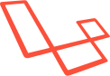

## Hi there 👋,I'm Abhishek

### Junior Software Engineer

- 🔭 I’m currently working on Money mangement system
- 🌱 I’m currently learning Rust for deepning my skills in software engineering
- 👯 I’m looking to collaborate on Rust-based and Other Opensource projects intrests 
### Languages and Tools:

       

- ##### Frameworks
  

<!--
**Animati0n/Animati0n** is a ✨ _special_ ✨ repository because its `README.md` (this file) appears on your GitHub profile.

Here are some ideas to get you started:

- 🔭 I’m currently working on ...
- 🌱 I’m currently learning ...
- 👯 I’m looking to collaborate on ...
- 🤔 I’m looking for help with ...
- 💬 Ask me about ...
- 📫 How to reach me: ...
- 😄 Pronouns: ...
- ⚡ Fun fact: ...
-->
